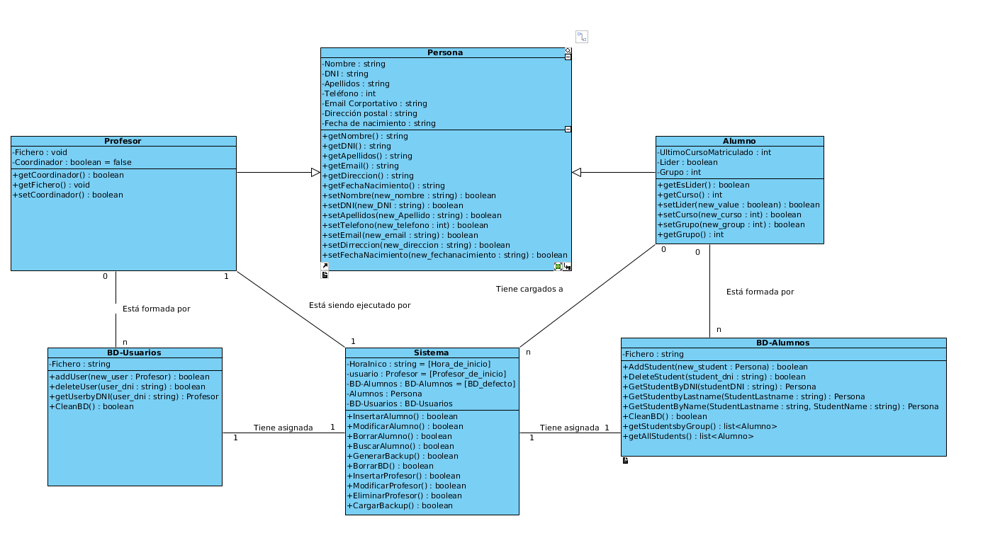

# Diagrama de clases

El sistema estará formado por distintas clases que se relacionarán entre sí para cumplir con todas las funcionalidades y requisitos del mismo.

La clase Persona, superclase de Alumno y Profesor, contiene los parámetros y métodos comunes a estos dos actores del sistema. Estos parámetros representan todos los datos que han de guardarse en la base de datos. 

A estos atributos comunes agregamos, por parte de la clase Profesor, el nombre de su fichero de credenciales y un el atributo que señalará si ese profesor es coordinador o no. De igual forma, por parte de la clase Alumno, añadimos los atributos Grupo, UltimoCursoMatriculado y Lider. Este último señalará si el alumno es lider de su grupo o no.

La clase BD-sistema representa la base de datos que guarda los datos de los usuarios y los alumnos. Esta contiene los métodos necesarios para la gestión de los usuarios y los alumnos.

Por último la clase Sistema representa nuestro programa como tal y contiene los métodos que harán posible cumplir con los requisitos del mismo. Los atributos pertenecientes a esta clase guardan la relación con el profesor conectado al sistema, las bases de datos activas y los alumnos con los que se está trabajando en ese momento.